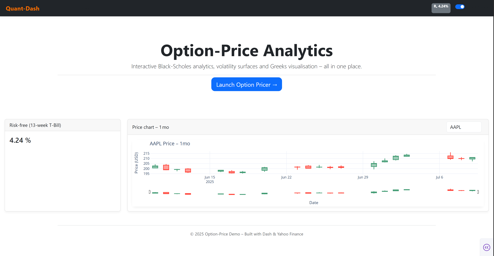
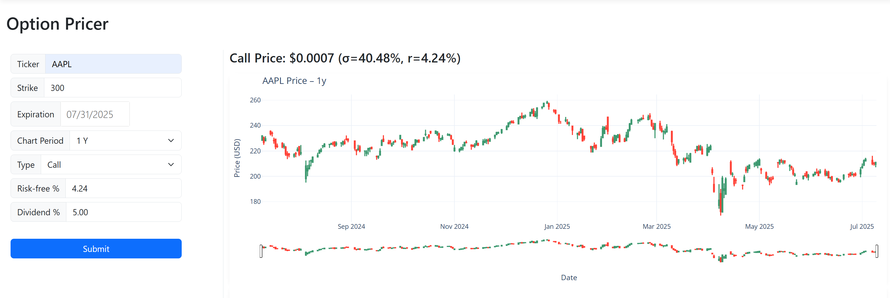
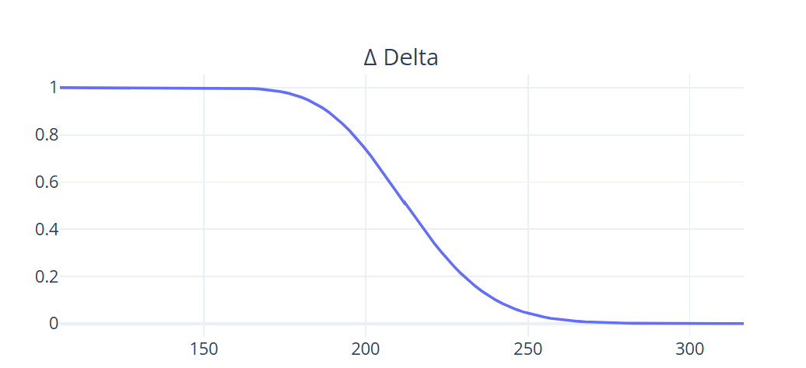
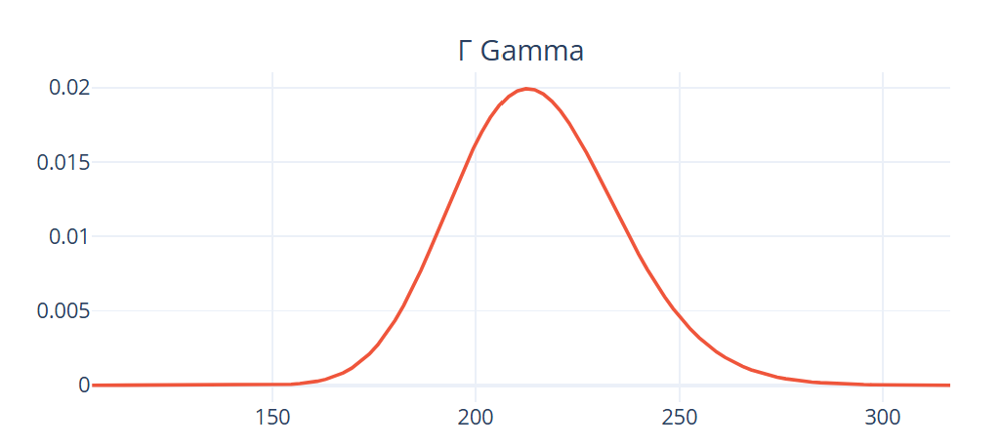
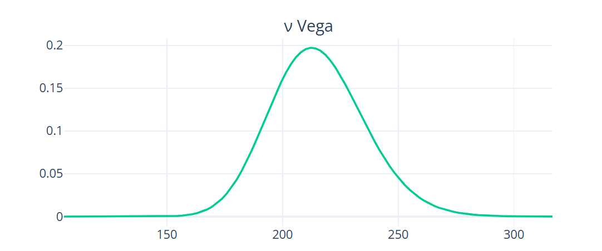
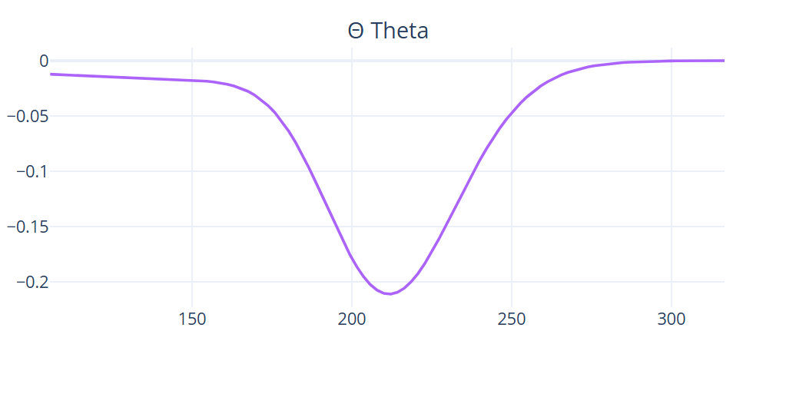
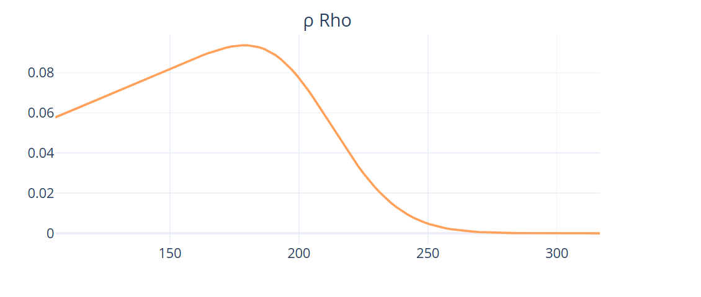
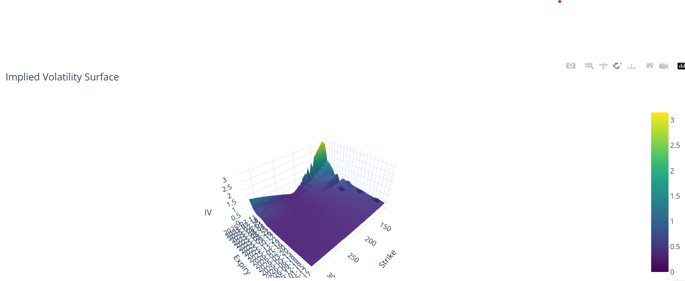

# 🧠 Option‑Price Analytics Dashboard

A responsive Dash app for pricing options using the Black‑Scholes‑Merton model — featuring real-time Yahoo Finance data, implied volatility surfaces, and Greek visualizations.


---

## 🔍 Overview

This application allows users to:
- Input a stock ticker, strike price, and expiration
- Fetch real-time risk-free rates and dividends
- Visualize pricing, Greeks (Delta, Gamma, Vega, Theta, Rho), and implied volatility
- Interact with intuitive Dash components styled via Bootstrap and custom CSS

---

## ✨ Features

✅ Black‑Scholes‑Merton pricing  
✅ Greeks visualization via Plotly subplots  
✅ Implied volatility surface with 3D surface plot  
✅ Real-time risk-free and dividend yield fetching  
✅ Responsive UI with dark mode support  
✅ Built-in chart period selector and auto-refresh intervals  
✅ Modular, production-grade layout with multi-page routing

---

## ⚙️ Tech Stack

| Layer            | Stack                                              |
|------------------|----------------------------------------------------|
| Frontend (UI)    | [Dash](https://dash.plotly.com/), Bootstrap, Plotly |
| Backend (Logic)  | NumPy, SciPy, yfinance, Yahoo Finance API          |
| Styling          | Custom CSS (in `Design/style.css`), Font Awesome   |
| Deployment       | Flask (via Dash), ready for Heroku or Docker       |

---

## 🚀 Run Locally

1. **Clone the repo:**
   ```bash
   git clone https://github.com/<your-username>/Quant-Dash.git
   cd Quant-Dash
   ```

2. **Install dependencies:**
   ```bash
   pip install -r requirements.txt
   ```

3. **Run the app:**
   ```bash
   python app.py
   ```

4. **Open your browser and go to:**
   ```bash
   http://localhost:5050
   ```

## 📁 Folder Structure
   ```
   Option-Price/
│
├── app.py                # Main Dash app entry point
├── requirements.txt
├── .gitignore
├── Design/               # Contains style.css and logo.png
├── Component/            # Navbar
├── pages/
│   └── options/
│       ├── components.py
│       ├── functions.py
│       ├── layout.py
├── landing.py            # Home landing page
```
## 📸 Screenshots

### 📍 Landing Page



### 📍 Option Pricer Dashboard




### 📈 Greeks

| Δ Delta | Γ Gamma |
|---------|---------|
|  |  |

| ν Vega | Θ Theta |
|--------|---------|
|  |  |

| ρ Rho | Implied Volatility Surface |
|--------|----------------------------|
|  |  |


